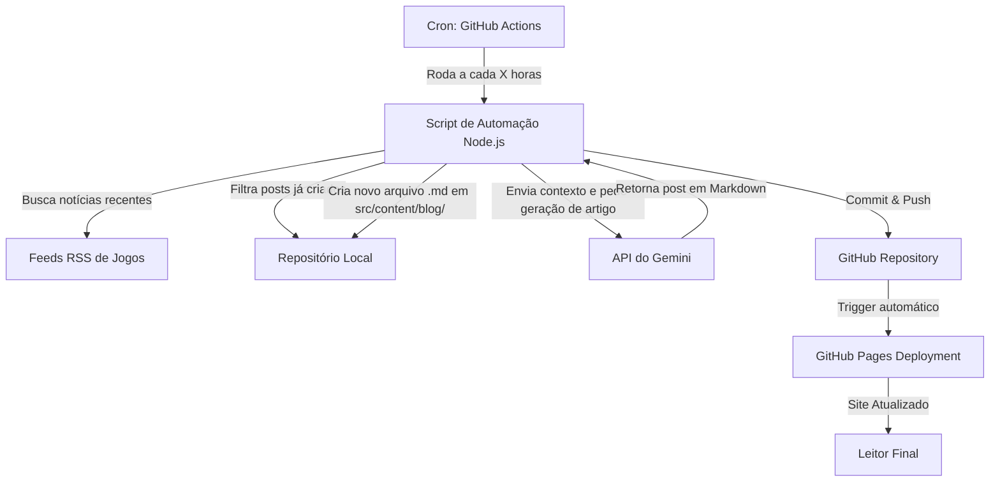

# Plano de Implementação: Blog Autossuficiente "Vamos Jogando"

Este plano descreve o design e a arquitetura para criar o blog de notícias de videogame **Vamos Jogando**. Ele será hospedado gratuitamente no GitHub Pages e utilizará GitHub Actions + API do Gemini para buscar notícias de fontes conhecidas e publicar novos artigos de forma 100% automatizada.

## Arquitetura do Sistema



---

## Plataforma e Tecnologias

### 1. Hospedagem (Sem Custo)
* **GitHub Pages**: Hospedagem estática gratuita, extremamente confiável, integrada com controle de versão.
* **GitHub Actions**: Rodará a automação de geração de posts através de uma tarefa agendada (Cron) e fará o deploy automático do site.

### 2. Framework Frontend
* **Astro**: O framework moderno mais recomendado para blogs e sites de conteúdo.
  * Gera HTML estático puro por padrão (ultra rápido).
  * Suporta Markdown de forma nativa através de "Content Collections", facilitando a inserção automática de posts.
  * Excelente para SEO.

### 3. Design & Estética (Premium)
* **Tema**: Gamer moderno (Dark mode por padrão).
* **Paleta de Cores**: Tons escuros (carbono, grafite) com detalhes e acentos em cores neon vibrantes (roxo elétrico, ciano, verde neon) para dar uma identidade premium.
* **Componentes**: 
  * Cards de posts com efeitos de hover brilhantes (glow).
  * Efeitos de Glassmorphism (transparência com blur) no header e em elementos flutuantes.
  * Transições de página suaves.
  * Layout responsivo completo (Mobile first).

### 4. Motor de IA (Autossuficiente)
* **Gemini API (Google)**: Usaremos o modelo `gemini-2.5-flash` ou similar, que possui uma cota gratuita generosa.
* **Processo de Geração**:
  1. O script consome feeds RSS de sites populares (ex: *IGN Brasil*, *Voxel*, *Eurogamer.pt*, *Jovem Nerd*).
  2. Identifica os temas do dia e seleciona os títulos mais quentes que ainda não foram publicados no blog.
  3. Envia o título e o resumo/conteúdo inicial ao Gemini.
  4. O Gemini gera um artigo completo, em português, reescrito com um tom engajador, opinativo/informativo de gamer, incluindo tags, resumo, SEO keywords e formatação rica em Markdown.
  5. O arquivo markdown é salvo na pasta de posts.

---

## Proposta de Estrutura do Repositório

```text
vamosjogando/
├── .github/
│   └── workflows/
│       ├── auto-publish.yml    # Executa o script de IA via Cron e commita novos posts
│       └── deploy.yml          # Compila o Astro e faz o deploy no GitHub Pages
├── cron/
│   ├── generate-post.js        # Script Node.js que busca notícias, chama Gemini e salva o post
│   ├── feeds.js                # Lista de feeds RSS de jogos confiáveis
│   └── package.json            # Dependências do script (rss-parser, @google/genai, etc.)
├── src/
│   ├── content/
│   │   ├── config.ts           # Configuração da coleção de blog (esquema de metadados)
│   │   └── blog/               # Onde os arquivos markdown (.md) dos posts serão salvos
│   ├── layouts/
│   │   └── Layout.astro        # Layout base (meta tags, header, footer, CSS global)
│   ├── pages/
│   │   ├── index.astro         # Página inicial com lista de posts (layout em grid premium)
│   │   └── blog/
│   │       └── [slug].astro    # Página de visualização de cada post
│   └── styles/
│       └── global.css          # Estilos globais (Design tokens, Neon Glow, Glassmorphism)
├── astro.config.mjs            # Configuração do Astro
└── package.json                # Dependências do frontend
```

---

## Perguntas em Aberto para o Usuário

> [!IMPORTANT]
> Por favor, analise as questões abaixo para podermos ajustar o plano conforme sua preferência:
>
> 1. **Frequência de Postagem**: Com qual frequência você gostaria que novos artigos fossem publicados? (Ex: 1 vez por dia, 2 vezes por dia, a cada 6 horas?).
> 2. **Fontes de Notícias**: Você tem preferência por algum site específico de games para usarmos como fonte das notícias (ex: IGN Brasil, Voxel, Eurogamer, Jovem Nerd)? Ou podemos selecionar uma lista padrão de portais brasileiros?
> 3. **API Key do Gemini**: Você já possui uma chave de API do Gemini (Google AI Studio)? Se não, posso te orientar sobre como conseguir uma gratuitamente. Ela será salva de forma segura nos "Secrets" do seu repositório do GitHub.

---

## Plano de Verificação

### Testes Automatizados e Locais
1. **Script de Geração**: Executaremos o script localmente simulando a chamada da API do Gemini e verificando se os arquivos Markdown são gerados corretamente no diretório `src/content/blog/` com a formatação e metadados adequados.
2. **Build do Astro**: Rodaremos o build de produção do Astro localmente para garantir que não haja erros de renderização estática.
3. **Validação de Responsividade e Estética**: Utilizaremos a ferramenta de navegação do browser para validar o visual do site (layout, cores neon, fontes, responsividade e interações).

### Verificação Manual
1. Instruções claras para o usuário criar o repositório no GitHub, configurar a chave do Gemini nos Secrets do GitHub e habilitar o GitHub Pages.
